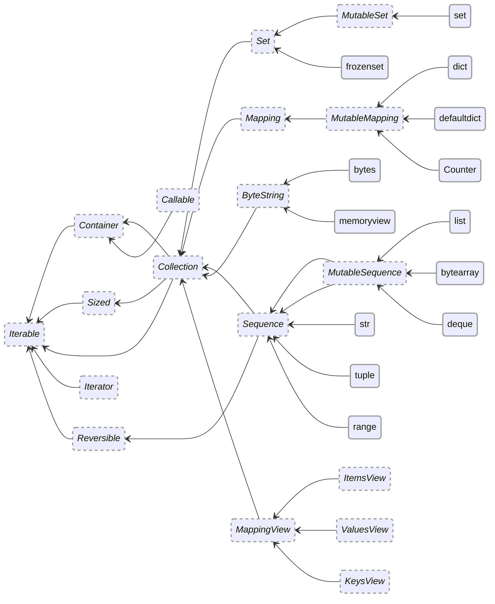

# Python conventions

## Modules

Add all public members to `__all__`, declared immediately after the imports.
(Note that [mkdocstrings](https://github.com/mkdocstrings/mkdocstrings) requires this.)

Use `mainpkg/__init__.py` to `import` the most important classes.
Do not set `__author__` or similar fields, but do set `mainpkg/__version__`.

## Formatting

The [Ruff formatter](https://docs.astral.sh/ruff/formatter/)
– which is equivalent to [Black](https://github.com/psf/black)
– should be used, so don’t worry much about formatting.
Avoid add trailing commas so that Black can decide whether to keep code on one line or to chop it.

Sometimes Ruff/Black wraps lines in awkwardly, by prioritizing argument lists over call chains.
If this happens, either shorten the lines or break the code into multiple statements.
For example:

=== "❌ Incorrect"

	```python
	data = my_long_named_function_that_makes_the_line_too_long(
	    data
	).my_other_long_named_function_being_chained(1)
	```

=== "✅ Correct – shorten function names"

	```python
	data = my_shorter_function(data).my_other_shorter_function(1)
	```

=== "✅ Also Correct – split up statements"

	```python
	data = my_long_named_function_that_makes_the_line_too_long(data)
	data = data.my_other_long_named_function_being_chained(1)
	```

## Pydantic and dataclasses

Use [pydantic](https://pydantic-docs.helpmanual.io/) or
[dataclasses](https://docs.python.org/3/library/dataclasses.html).
Most libraries should use dataclasses only to avoid a dependency on pydantic.
Use immutable types unless there’s a compelling reason otherwise.

??? Example

    === "dataclass"

        ```python
        from typing import Self
        from dataclasses import dataclass


        @dataclass(slots=True, frozen=True, order=True)
        class Cat:
            breed: str | None
            age: int
            names: frozenset[str]
        ```

    === "Pydantic"

        ```python
        from pydantic import BaseModel


        class Cat(BaseModel):
            breed: str | None
            age: int
            names: frozenset[str]

            class Config:
                frozen = True
        ```

    === "Pydantic (orjson)"

        ```python
        import orjson
        from pydantic import BaseModel


        def to_json(v) -> str:
            return orjson.dumps(v).decode(encoding="utf-8")


        def from_json(v: str):
            return orjson.loads(v).encode(encoding="utf-8")


        class Cat(BaseModel):
            breed: str | None
            age: int
            names: frozenset[str]

            class Config:
                frozen = True
                json_loads = from_json
                json_dumps = to_json
        ```

## Abstract base classes

Inherit directly from abstract base classes in the
[`collections.abc`](https://docs.python.org/3/library/collections.abc.html)
module.

```python
from collections.abc import Sequence, MutableSequence
from dataclasses import dataclass
from typing import Literal, Self


@dataclass(slots=True, frozen=True)
class AxisTicks(Sequence[int]):

    orientation: Literal["x"] | Literal["y"]
    items: Sequence[int]

    def __getitem__(self: Self, i: int) -> int:
        return self.items[i]

    def __len__(self: Self) -> int:
        return len(self.items)


# Error!
# dataclasses.FrozenInstanceError: cannot assign to field 'orientation'
AxisTicks(orientation="x", items=[1, 3, 5])
a.orientation = "y"
```

**`list` and `Sequence` are not the same!**
You should use `Sequence` or `MutableSequence` for typing, not `list`.
Refer to this hierarchy:



## Class members

Use `@abstractmethod` in favor of `@staticmethod`;
`@staticmethod` should only be used in the rare cases where `@abstractmethod` cannot be used.
As a general rule, prefer using a regular method over an `@abstractmethod`.

Sort class members in the following order.

1. `ClassVar`
2. attributes
3. `@staticmethod`
4. `@classmethod`
5. magic methods
6. `@property` methods, getters, and setters
7. regular methods
8. inner classes

Within each of the 8 types, order by, in order of decreasing importance:

1. Pairing getters and setters together, with the getter first.
2. Listing public, then private (`_xxx`), then dunder (`__xxx`).

## OS compatibility

Use `pathlib` instead of `os` wherever possible.
Always read and write text as UTF-8, and pass `encoding="utf-8"` (i.e. not `utf8` or `UTF-8`).

??? Example

    ```python
    from pathlib import Path

    directory = Path.cwd()
    (directory / "myfile.txt").write_text("hi", encoding="utf-8")
    ```

## Typing

??? rationale

    1. Documentation generators such as [mkdocstrings](https://github.com/mkdocstrings/mkdocstrings)
       (for mkdocs) can use type annotations to provide helpful hints for users;
       type annotations also aid reading source code.
    2. Linters, IDEs, and other tools use them to detect mistakes.
    3. Tools can use type annotations to detect incorrect types at runtime.
       This can be especially useful because duck typing prevents complete test coverage.
    4. For annotating `self` and `cls`: they are still subject to
       [Ruff’s ANN rules](https://docs.astral.sh/ruff/rules/#flake8-annotations-ann).

Use typing annotations for both public APIs and internal components.
Annotate all module-level variables, class attributes, and functions.
Annotate both return types and parameters.
Annotate `self`, `cls`, `*args`, and `**kwargs` parameters.

??? Example

    ```python
    from dataclasses import dataclass
    from typing import Any, Self, Unpack


    @dataclass(slots=True, frozen=True)
    class A(SomeAbstractType):
        value: int

        @classmethod
        def new_zero(cls: type[Self]) -> Self:
            return cls(0)

        def __add__(self: Self, other: Self) -> Self:
            return self.__class__(self.value + other.value)

        def add_sum(self: Self, *args: int) -> Self:
            return self.__class(self.value + sum(args))

        def delegate(self: Self, *args: Any, **kwargs: Unpack[tuple[str, Any]]) -> None:
            ...  # first do something special
            super().delegate(*args, **kwargs)
    ```

## Docstrings

Use [Google-style docstrings](https://google.github.io/styleguide/pyguide.html#38-comments-and-docstrings)
as [mkdocstrings supports](https://mkdocstrings.github.io/griffe/docstrings/#google-style).

## Ruff rules

Use [Ruff](https://docs.astral.sh/ruff/) to catch potential problems and bad practices.
Use **at least** the rules enabled in the
[cicd pyproject.toml](https://github.com/dmyersturnbull/cicd/blob/main/pyproject.toml).

To disable counting a line or block in test coverage, use `# nocov` (not `# pragma: nocov`, etc.).
