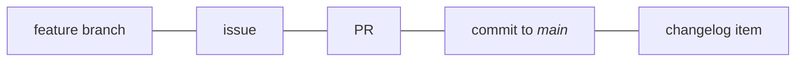

# Maintainer guide

!!! abstract "How to use these docs"
    These docs are meant to be linked to.
    Include a link in your project’s readme or `CONTRIBUTING.md` file.
    E.g.,
    ```markdown
    See https://dmyersturnbull.github.io/ref/maintainer-guide/
    but disregard the `security:` commit type.
    ```

    Or just link to individual sections; e.g.,
    ```markdown
    Source headers: Refer to https://dmyersturnbull.github.io/ref/maintainer-guide/#source-headers
    ```

This guide is collection of best-practices that are easy to learn, use, and automate.
It specifies:

- One-commit-to-one-PR and one-issue-to-one-PR policies
- A commit message specification compatible with [Conventional Commits](https://www.conventionalcommits.org/)
- `type:` issue labels that map 1-1 with commit types and map to changelog sections

## Development process overview

There should be a 1-1-1-1-1 correspondence between
issues, feature branches, pull requests, commits to the *main* branch, and changelog items.
This simplifies project management, makes development more transparent,
and facilitates automation that reduces manual effort and potential human error.



## Changelog generation

A very prominent automation this enables is automatic generation of actually useful changelogs.
It allows
[commitizen](https://github.com/commitizen-tools/commitizen),
[GitHub’s automatically generated release notes feature](https://docs.github.com/en/repositories/releasing-projects-on-github/automatically-generated-release-notes),
and other tools to produce well-organized changelogs that cover every significant change
but exclude unimportant ones (e.g. with commit type `style`).
The changelog entries can be linked, too.
In fact, every entry can be linked to the corresponding issue, PR, and commit.

??? example

    ### Bug fixes

    - fix: correct return value of /api/v1/calculate-sigma when epsilon is 0
      (fixes [issue #14](https://github.com/org/repo/issues/14)):
      [PR:11](https://github.com/org/repo/pull/11)/[831e229c](https://github.com/org/repo/commit/831e229c)

### Branches

Use
[trunk-based development](https://www.atlassian.com/continuous-delivery/continuous-integration/trunk-based-development).
In that terminology, a <i>feature branch</i> is a branch to be merged into <i>main</i>.
All development should happen in feature branches, and short-lived feature branches are preferred.
Name feature branches `<type>/<issue>-<description>--<author-initials>`, where `<type>` is the issue type
(see the [section on commit types](#commit-types)),
`<issue>` is the issue number, `<description>` is a short description of the issue,
Example: `doc/14-japanese-translation--sw`.

Each feature branch must be tied to exactly 1 issue and result in 1 merge to <i>main</i>.
Feature branches should be squash-merged.

!!! example

    ```mermaid
    gitGraph
    commit id: "initial" tag: "v0.1.0"
    commit id: "update docs"
    branch feat/12-async-api--dmt
    checkout feat/12-async-api--dmt
    commit id: "start feature"
    checkout main
    commit id: "fix bug" tag: "v0.1.1"
    checkout feat/12-async-api--dmt
    commit id: "complete feature"
    checkout main
    merge feat/12-async-api--dmt id: "squash and rebase" tag: "v0.2.0"
    ```

In some situations, earlier versions need to be maintained, such as for security fixes.
These must be in branches named `releases/<version>` (e.g., `releases/v1`).

### Issues

Issues to be worked on must have exactly 1 `type:` label, and they should have the label `state: ready for dev`.
Use `effort:` and `priority:` labels where helpful.

Split large issues into bit-sized pieces and list those in the larger issue’s description.

!!! example

    ```markdown
    Requires several steps:

    - [x] [write schema](#21)
    - [x] [build schema linter](#22)
    - [ ] [create infrastructure to deploy schema](#23)
    ```

### Handling pull requests

Before required status checks have completed successfully, avoid submitting reviews.
Instead, just comment.

Squash the commits into one, and ensure the resulting commit message follows the
[commit message format](#reference) specification.

!!! tip "GitHub squash and merge

    GitHub has a "Squash and merge" button, but there is nowhere to add a commit body or footer.
    However, you can work around this in the repository settings:
    Under "General" → "Pull Requests" → "Allow squash merging" (which should be checked),
    set "default commit message" to "Pull request title and description".

    Before clicking "Squash and merge", edit the PR title and description.
    The title will be the commit message, and the description will be the commit body and footer.
    (Separate the body and footer with a blank line.)

To help a contributor with their PR directly, see
["Committing changes to a pull request branch created from a fork"](https://docs.github.com/en/pull-requests/collaborating-with-pull-requests/proposing-changes-to-your-work-with-pull-requests/committing-changes-to-a-pull-request-branch-created-from-a-fork).
If the contributor abandoned the PR, instead use `gh pr checkout <number>`.

### Versioning

Versioning is a subset of [Semantic Versioning](https://semver.org/spec/v2.0.0.html).
Pre-releases are permitted only in the forms `alpha<int>`, `beta<int>`, and `rc<int>`, where `<int>` starts at 0.
Alpha/beta/RC MUST NOT be used out of order (e.g., **not** `alpha1`, `beta1`, `alpha2`).

### Tags and deployment

Tags of the form `v<semver>` should result in full deployments.
Tags of the form `v<major>` should automatically track their most recent semver tags.
The `latest` tag should always match the main branch.

## Repository contents

### File types

- _Prefer open standards:_
  Choose AVIF or WEBP over other image formats, OGG and FLAC over other audio formats;
  choose AV1 over other video formats;
  and choose webm over (non-webm) MKV.
- _Use simpler formats:_
  Use Markdown
- _Use modern compression:_
  Prefer modern algorithms like [LZ4](https://github.com/lz4/lz4) (`.lz4`)
  and [ZSTD](https://github.com/facebook/zstd) (`.zst`).

### Source headers

Ensure that nontrivial files contain a header such as

```text
SPDX-FileCopyrightText: Copyright <years>, Contributors to <project>
SPDX-PackageHomePage: <url>
SPDX-License-Identifier: <spdx-id>
```

!!! example

    For [Tyranno](https://github.com/dmyersturnbull/tyrannosaurus), this is:

    ```text
    SPDX-FileCopyrightText: Copyright 2020-2024, Contributors to CICD
    SPDX-PackageHomePage: https://github.com/dmyersturnbull/tyranno
    SPDX-License-Identifier: Apache-2.0
    ```

### 3rd-party code

Use SPDX headers in the aforementioned form.
Include a section in `NOTICE.txt` mentioning the source file(s), license, and external source.
Include the license file in the form `LICENSE-<spdx-id>.txt`.

## Commit messages

### Conventional commit messages

Commit messages must follow a subset of [Conventional Commits](https://www.conventionalcommits.org/).

- Breaking changes MUST use `!`.
- The body SHOULD be written as CommonMark.
  In that case, headings more significant than level 4 (`####`) MUST NOT be used.
  (Treat the subject as a level 3 (`###`) heading.)
  Imperative phrasing SHOULD be used.
- Footers MUST be listed one per line in a single paragraph.
- For a breaking change, if a body is included, the `BREAKING CHANGE:` footer MUST be present.
- If a body is included, deprecations SHOULD be indicated by a `Deprecates:` footer
  of the form `Deprecates: first, second`.
- Closed issues MUST be listed in a footer of the form `Closes: #10, #22, #33`.
- A set of allowed Git trailers is defined, and additional trailers SHOULD NOT be used.
- Footers MUST be ordered as `BREAKING CHANGE:`, `Deprecates:`, `Closes:`, and then Git trailers.
- If the Git trailer `Signed-off-by:` is used, it SHOULD be last.
- Each commit type MUST be
  `drop`, `depr`, `feat`, `security`, `fix`, `perf`, `build`, `docs`, `test`, `ci`, `refactor`, `style`, or `chore`.

??? details "Allowed Git trailers"

    - Acked-by
    - Reviewed-by
    - Helped-by
    - Reported-by
    - Mentored-by
    - Suggested-by
    - CC
    - Noticed-by
    - Tested-by
    - Improved-by
    - Thanks-to
    - Based-on-patch-by
    - Contributions-by
    - Co-authored-by
    - Requested-by
    - Original-patch-by
    - Inspired-by
    - Signed-off-by

!!! example "Examples – only message"

    <b>Example 1:</b>

    ```text
    feat!: add schema
    ```

    <b>Example 2:</b>

    ```text
    doc(i18n): add JP translation
    ```

!!! example "Example – body and footers"

    ```text
    feat!: add major new feature

    Introduce option to set custom template **for paid users only**.

    Define template parameters:
    - name
    - status

    BREAKING CHANGE: /api/v1/generate-report endpoint
    Closes: #14
    Co-authored-by: Amelia Johnson <amelia@dev.com>
    Co-authored-by: Cecilia Johnson <cecilia@dev.com>
    Reviewed-by: Kerri Hendrix <kerri@dev.com>
    Acked-by: Tom Monson <joe@dev.com>
    Signed-off-by: Sadie Wu <sadie@dev.com>
    ```

**Refer to the [supplemental labels document](../ref/issue-labels.md#table) for details.**

#### Invalid and reverted changes

Note that there is no `invalid` or `state: invalid`:
Duplicate issues, issues created by mistake, uninterpretable issues, etc., should be
[deleted](https://docs.github.com/en/issues/tracking-your-work-with-issues/deleting-an-issue).

Also, there is no `revert` type.
Instead, use the type that reflects the reversion commit.
This might be `drop:` or the type of the reverted commit.
**Label both commits with `announce: no`.**

#### Forcibly omitting or including release notes entries

Use `announce: no` and `announce: yes` to override which changes are included in the release notes.

<b>`announce: no`</b> excludes changes that would normally be included (e.g. `feat:`).
Use it for

- reversions and reverted commits,
- trivial changes, and
- `docs:`, `tests:`, `style:`, etc. commits that support a `feat:` commit added in the same release.

<b>`announce: yes`</b> adds changes that would normally be ommitted (e.g. `style`).
Use it only to acknowledge unusually important `style` and `chore` contributions.

#### Including dependent changes in one commit

It is completely acceptable – and encouraged –
to add tests and documentation for a new feature inside a `feat:` commit,
to remove them inside a `drop:` commit,
and to update them inside a `fix:` or `security:` commit.

If separate commits were made, consider applying `announce: no` to some, as described in the section above.

??? details

    Effectively, some types can be subsumed into others.
    This diagram details the allowed ways:

    ```mermaid
    graph TD
        fix --> feat
        security --> feat
        perf --> feat
        test --> fix
        test --> feat
        test --> perf
        test --> security
        docs --> feat
        docs --> fix
        ci --> build
        build --> fix
        refactor --> feat
        refactor --> fix
        refactor --> build
        refactor --> ci
        refactor --> test
        refactor --> security
        s["style"] --> any["*"]
    ```

### Scopes

Scopes should be defined per project.
If a scope is defined, it should be applied to all relevant commits,
at least to those made after the scope’s introduction.

Suggestions:

- `i18n`
- `plugins`

### Reference

!!! details "Pattern"

    ```text
    <type>[(<scope>)][!]: <subject>

    <body>

    [BREAKING CHANGE: <feature, etc.>]
    [Deprecates: <feature, etc.>]
    [Closes: #<issue>]
    [*: <author>]+
    Signed-off-by: <author>
    """
    ```
