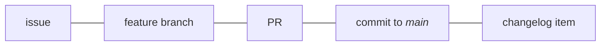

# Maintainer guide

<!--
SPDX-FileCopyrightText: Copyright 2017-2025, Douglas Myers-Turnbull
SPDX-PackageHomePage: https://dmyersturnbull.github.io
SPDX-License-Identifier: CC-BY-SA-4.0
-->

!!! abstract "How to use these docs"

    These docs are meant to be linked to.
    Include a link in your project’s readme or `CONTRIBUTING.md` file.
    E.g.,

    ```markdown
    See https://dmyersturnbull.github.io/ref/maintainer-guide/
    but disregard the `security:` commit type.
    ```

    Or just link to individual sections; e.g.,
    ```markdown
    Source headers: Refer to https://dmyersturnbull.github.io/ref/maintainer-guide/#source-headers
    ```

This guide is collection of best-practices that are easy to learn, use, and automate.
It specifies:

- One-commit-to-one-PR and one-issue-to-one-PR policies
- A commit message specification compatible with [Conventional Commits](https://www.conventionalcommits.org/)
- `type:` issue labels that map 1-1 with commit types and map consistently to changelog sections

## Development process overview

There should be a 1-1-1-1-1 correspondence between
issues, feature branches, pull requests, commits to the _main_ branch, and changelog items.
This simplifies project management, makes development more transparent,
and facilitates automation that reduces manual effort and potential human error.



## Changelog / release notes generation

This enables generation of changelogs that are actually useful.
It allows
[GitHub’s automatically generated release notes feature](https://docs.github.com/en/repositories/releasing-projects-on-github/automatically-generated-release-notes)
and other tools to produce well-organized changelogs that cover every significant change
but exclude unimportant ones (e.g. `style`).
Changelog entries can be linked, too.
In fact, every entry can be linked to the corresponding issue, PR, and commit.

???+ example

    ### Deprecations

    - depr: deprecate /api/v1/ (use /api/v2 instead)
      ([issue: #14](https://github.com/org/repo/issues/14)
      / [PR: #11](https://github.com/org/repo/pull/11)
      / [commit: 831e229c](https://github.com/org/repo/commit/831e229c))

### Branches

Use
[trunk-based development](https://www.atlassian.com/continuous-delivery/continuous-integration/trunk-based-development).
In that terminology, a _feature branch_ is a branch to be merged into _main_.
All development should happen in feature branches, and short-lived feature branches are preferred.
Name feature branches `<type>/<issue>-<description>--<initials>`, where `<type>` is the issue type
(see the [section on commit messages](#commit-messages)),
`<issue>` is the issue number, `<description>` is a 1–4-word description
(obviously not containing `--`),
and `<initials>` are the creator’s initials (lowercase; punctuation removed; `[a-z]+`).

If no issue is associated, use substitute `x` for `<issue>`.
For example, this is appropriate for branches that update pinned dependencies in a lock file.

!!! abstract "Summary: feature branch naming"

    `<type>/<issue>-<description>--<initials>`; e.g. `fix/9-sighup-crash--kj`

    If no issue is associated, use
    `<type>/<description>--<initials>`; e.g. `fix/fix-dependencies--kj`

Each feature branch MUST be tied to exactly 1 issue and SHOULD result in 1 commit to _main_.
That means that branches SHOULD normally be squash-merged.

???+ example

    ```mermaid
    gitGraph
    commit id: "initial" tag: "v0.1.0"
    commit id: "update docs"
    branch feat/12-async-api--dmt
    checkout feat/12-async-api--dmt
    commit id: "start feature"
    checkout main
    commit id: "fix bug" tag: "v0.1.1"
    checkout feat/12-async-api--dmt
    commit id: "complete feature"
    checkout main
    merge feat/12-async-api--dmt id: "squash and rebase" tag: "v0.2.0"
    ```

In some situations, earlier versions need to be maintained, such as for security fixes.
Name these branches by `releases/<version>` (e.g., `releases/v1`).

### Issues

Issues must have exactly 1 `type:` label.
Use `effort:` and `priority:` labels if they are helpful.
Split large issues into bit-sized pieces and list those in the larger issue’s description.

???+ example

    ```markdown
    Requires several steps:

    - [x] [write schema](#21)
    - [x] [build schema linter](#22)
    - [ ] [create infrastructure to deploy schema](#23)
    ```

### Handling pull requests

Before required status checks have completed successfully, avoid submitting reviews.
Instead, just comment.

Squash the commits into one, and ensure the resulting commit message follows the
[commit message format](../spec/commit-messages.md) specification.

???+ tip "Tip": GitHub squash and merge"

    GitHub has a "Squash and merge" button, but there is nowhere to add a commit body or footer.
    However, you can work around this in the repository settings:
    Under _General ➤ Pull Requests ➤ Allow squash merging_ (which should be checked),
    set _default commit message_ to _Pull request title and description_.

    Before clicking "Squash and merge", edit the PR title and description.
    The title will be the commit message, and the description will be the commit body and footer.
    (Separate the body and footer with a blank line.)

To help a contributor with their PR directly, see
[“Committing changes to a pull request branch created from a fork”](https://docs.github.com/en/pull-requests/collaborating-with-pull-requests/proposing-changes-to-your-work-with-pull-requests/committing-changes-to-a-pull-request-branch-created-from-a-fork).
If the contributor abandoned the PR, instead use `gh pr checkout <number>`.

### Versioning

Versioning is a subset of [Semantic Versioning](https://semver.org/spec/v2.0.0.html).
Pre-release numbers are discouraged.
If used, restrict to these forms:
`alpha.<int>`, `beta.<int>`, and `rc.<int>`,
where `<int>` starts at 0.
Alpha/beta/RC MUST NOT be used out of order (e.g., **not** `alpha.1`, `beta.1`, `alpha.2`).
Pre-release numbers also **SHOULD NOT be used in Python projects** because
[PEP 440](https://peps.python.org/pep-0440/) and [semver.org](https://semver.org/) prescribe different formats.
If you need to use them

### Tags and deployment

Tags of the form `v<semver>` should result in full deployments.
Tags of the form `v<major>` and `v<major>.<minor>`
should automatically track their most recent semver tags,
and the `latest` tag should track the main branch.

## Repository contents

### File types

- Prefer open standards like AVIF, WEBP, OGG, FLAC, and AV1.
  (Choose webm over the more general MKV.)
- Use simpler formats, like Markdown instead of ReST.
- Prefer modern compression algorithms like
  [LZ4](https://github.com/lz4/lz4) (`.lz4`)
  and [ZSTD](https://github.com/facebook/zstd) (`.zst`).

### Source headers

Ensure that nontrivial files contain a header such as

```text
SPDX-FileCopyrightText: Copyright <years>, Contributors to <project>
SPDX-PackageHomePage: <url>
SPDX-License-Identifier: <spdx-id>
```

???+ example

    For [Tyrannosaurus](https://github.com/dmyersturnbull/tyrannosaurus), this is:

    ```text
    SPDX-FileCopyrightText: Copyright 2020-2024, Contributors to Tyrannosaurus
    SPDX-PackageHomePage: https://github.com/dmyersturnbull/tyrannosaurus
    SPDX-License-Identifier: Apache-2.0
    ```

### 3rd-party code

Use SPDX headers in the aforementioned form.

Include a section in `NOTICE.txt` mentioning the source file(s), license, and external source.
Include the license file in the form `LICENSE-<spdx-id>.txt`.

If you are modifying the file, you need 2 sets of SPDX headers, which should be visually separated.
Follow those headers with a plain-language statement that you have modified the file.

???+ example

    Example from
    [rcsb/rcsb-chem-search pyproject.toml](https://github.com/rcsb/rcsb-chem-search/blob/master/pyproject.toml):

    ```python
    # SPDX-FileCopyrightText: Copyright 2020-2024, Contributors to Tyrannosaurus
    # SPDX-PackageHomePage: https://github.com/dmyersturnbull/tyrannosaurus
    # SPDX-License-Identifier: Apache-2.0
    #
    # SPDX-FileCopyrightText: Copyright 2024, Contributors to rcsb-chem-search
    # SPDX-PackageHomePage: https://github.com/rcsb/rcsb-chem-search
    # SPDX-License-Identifier: BSD-3-Clause
    #
    # Adapted from Tyrannosaurus <https://github.com/dmyersturnbull/tyrannosaurus>.
    ```

## Commit messages

!!! related "Important"

    **Review:**

    - The [supplemental table of labels](/ref/issue-labels.md#table)
    - The [commit message specificiation](../spec/commit-messages.md)
    - The [scopes section](#scopes) below

#### Invalid and reverted changes

Note that there is no `invalid` or `state: invalid`:
Duplicate issues, issues created by mistake, uninterpretable issues, etc., should be
[deleted](https://docs.github.com/en/issues/tracking-your-work-with-issues/deleting-an-issue).

Also, there is no `revert` type.
Instead, use the type that reflects the reversion commit.
This might be `drop:` or the type of the reverted commit.
**Label both commits with `changelog: exclude`.**

#### Forcibly omitting or including release notes entries

Use `changelog: exclude` and `changelog: exclude`
to override which changes are included in the release notes.

<b>`changelog: exclude`</b> excludes changes that would normally be included (e.g. `feat:`).
Use it for

- reversions and reverted commits,
- trivial changes, and
- `docs:`, `tests:`, `style:`, etc. commits that support a `feat:` commit added in the same release.

<b>`changelog: include`</b> adds changes that would normally be omitted (e.g. `style`).
Use it only to acknowledge unusually important `style` contributions.

#### Including dependent changes in one commit

It is completely acceptable – and encouraged –
to add tests and documentation for a new feature inside a `feat:` commit,
to remove them inside a `drop:` commit,
and to update them inside a `fix:` or `security:` commit.

If separate commits were made, consider applying `changelog: exclude` to some,
as described in the section above.

??? info "Subsuming types"

    Effectively, some types can be subsumed into others.
    This best-effort diagram attempts to show the allowed ways:

    ```mermaid
    graph TD
        security --> feature
        fix --> feature
        performance --> feature
        performance --> security
        performance --> fix
        build --> feature
        build --> drop
        build --> security
        test --> feature
        test --> drop
        test --> security
        test --> fix
        test --> performance
        docs --> feature
        docs --> drop
        docs --> security
        docs --> fix
        docs --> build
        docs --> deprecation
        cicd --> build
        refactor --> feature
        refactor --> drop
        refactor --> security
        refactor --> fix
        refactor --> performance
        s["style"] --> any[*]
        s["chore"] --> none[∅]
    ```

### Scopes

Projects should define their own scopes.
However, they must not redefine [scopes listed here](issue-labels.md#table)
or scopes defined in
In addition to `dev`, the optional scopes `i18n` and `plugin`
are defined for projects to adopt if desired.

Importantly, once defined, a scope should be applied consistently — to all relevant commits.
Commit messages can’t be modified, but projects MAY choose to manually add labels retroactively.
[Git notes](https://git-scm.com/docs/git-notes) might also be helpful.
