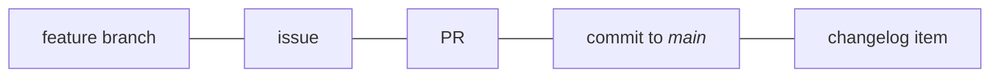

# Maintainer guide

!!! abstract "How to use these docs"
    These docs are meant to be linked to.
    Include a link in your project’s readme or `CONTRIBUTING.md` file.
    E.g.,
    ```markdown
    See https://dmyersturnbull.github.io/ref/maintainer-guide/
    but disregard the `security:` commit type.
    ```

    Or just link to individual sections; e.g.,
    ```markdown
    Source headers: Refer to https://dmyersturnbull.github.io/ref/maintainer-guide/#source-headers
    ```

This guide is collection of best-practices that are easy to learn, use, and automate.
It specifies:

- One-commit-to-one-PR and one-issue-to-one-PR policies
- A commit message specification compatible with [Conventional Commits](https://www.conventionalcommits.org/)
- `type:` issue labels that map 1-1 with commit types and map to changelog sections

## Development process overview

There should be a 1-1-1-1-1 correspondence between
issues, feature branches, pull requests, commits to the <i>main</i> branch, and changelog items.
This simplifies project management, makes development more transparent,
and facilitates automation that reduces manual effort and potential human error.
Complex things are hard; simple things are easy.



## Changelog generation

A very prominent automation this enables is automatic generation of actually useful changelogs.
It allows
[commitizen](https://github.com/commitizen-tools/commitizen),
[GitHub’s automatically generated release notes feature](https://docs.github.com/en/repositories/releasing-projects-on-github/automatically-generated-release-notes),
and other tools to produce well-organized changelogs that cover every significant change
but exclude unimportant ones (e.g. with commit type `style`).
The changelog entries can be linked, too.
In fact, every entry can be linked to the corresponding issue, PR, and commit.

??? example

    ### Bug fixes

    - fix: correct return value of /api/v1/calculate-sigma when epsilon is 0
      (fixes [issue #14](https://github.com/org/repo/issues/14)):
      [PR:11](https://github.com/org/repo/pull/11)/[831e229c](https://github.com/org/repo/commit/831e229c)

    ```markdown
    ### Bug fixes

    - fix: correct return value of /api/v1/calculate-sigma when epsilon is 0
      (fixes [issue #14](https://github.com/org/repo/issues/14)):
      [PR:11](https://github.com/org/repo/pull/11)/[831e229c](https://github.com/org/repo/commit/831e229c)
    ```

### Branches

Use
[trunk-based development](https://www.atlassian.com/continuous-delivery/continuous-integration/trunk-based-development).
In that terminology, a <i>feature branch</i> is a branch to be merged into <i>main</i>.
All development should happen in feature branches, and short-lived feature branches are preferred.
Name feature branches `<type>/<issue>-<description>--<author-initials>`, where `<type>` is the issue type
(see the [section on commit types](#commit-types)),
`<issue>` is the issue number, `<description>` is a short description of the issue,
Example: `doc/14-japanese-translation--sw`.

Each feature branch must be tied to exactly 1 issue and result in 1 merge to <i>main</i>.
Feature branches should be squash-merged.

!!! example

    ```mermaid
    gitGraph
    commit id: "initial" tag: "v0.1.0"
    commit id: "update docs"
    branch feat/12-async-api--dmt
    checkout feat/12-async-api--dmt
    commit id: "start feature"
    checkout main
    commit id: "fix bug" tag: "v0.1.1"
    checkout feat/12-async-api--dmt
    commit id: "complete feature"
    checkout main
    merge feat/12-async-api--dmt id: "squash and rebase" tag: "v0.2.0"
    ```

In some situations, earlier versions need to be maintained, such as for security fixes.
These must be in branches named `releases/<version>` (e.g., `releases/v1`).

### Issues

Issues to be worked on must have exactly 1 `type:` label, and they should have the label `status: ready for dev`.
Use `effort:` and `priority:` labels where helpful.

Split large issues into bit-sized pieces and list those in the larger issue’s description.

!!! example

    ```markdown
    Requires several steps:

    - [x] [write schema](#21)
    - [x] [build schema linter](#22)
    - [ ] [create infrastructure to deploy schema](#23)
    ```

### Handling pull requests

Do not submit a review until the required status checks completed successfully.
(You can add comments before this.)

Squash the commits into one, and ensure the resulting commit message follows the
[commit message format](#reference) specification.

!!! tip "GitHub squash and merge

    GitHub has a "Squash and merge" button, but there is nowhere to add a commit body or footer.
    However, you can work around this in the repository settings:
    Under "General" → "Pull Requests" → "Allow squash merging" (which should be checked),
    set "default commit message" to "Pull request title and description".

    Before clicking "Squash and merge", edit the PR title and description.
    The title will be the commit message, and the description will be the commit body and footer.
    (Separate the body and footer with a blank line.)

To help a contributor with their PR directly, see
["Committing changes to a pull request branch created from a fork"](https://docs.github.com/en/pull-requests/collaborating-with-pull-requests/proposing-changes-to-your-work-with-pull-requests/committing-changes-to-a-pull-request-branch-created-from-a-fork).
If the contributor abandoned the PR, instead use `gh pr checkout <number>`.

### Versioning

Versioning is a subset of [Semantic Versioning](https://semver.org/spec/v2.0.0.html).
Pre-releases are permitted only in the forms `alpha<int>`, `beta<int>`, and `rc<int>`, where `<int>` starts at 0.
Alpha/beta/RC MUST NOT be used out of order (e.g., **not** `alpha1`, `beta1`, `alpha2`).

### Tags and deployment

Tags of the form `v<semver>` should result in full deployments.
Tags of the form `v<major>` should automatically track their most recent semver tags.
The `latest` tag should always match the main branch.

Deploy off of the main branch or tags.
Make sure tests passed on the main branch before deploying.

## Repository contents

### File types

- _Prefer open standards:_
  Choose AVIF or WEBP over other image formats, OGG and FLAC over other audio formats;
  choose AV1 over other video formats;
  and choose webm over (non-webm) MKV.
- _Use simpler formats:_
  Use Markdown
- _Use modern compression:_
  Prefer modern algorithms like [LZ4](https://github.com/lz4/lz4) (`.lz4`)
  and [ZSTD](https://github.com/facebook/zstd) (`.zst`).

### Source headers

Ensure that nontrivial files contain a header such as

```text
SPDX-FileCopyrightText: Copyright <years>, Contributors to <project>
SPDX-PackageHomePage: <url>
SPDX-License-Identifier: <spdx-id>
```

!!! example

    For [Tyranno](https://github.com/dmyersturnbull/tyrannosaurus), this is:

    ```text
    SPDX-FileCopyrightText: Copyright 2020-2024, Contributors to CICD
    SPDX-PackageHomePage: https://github.com/dmyersturnbull/tyranno
    SPDX-License-Identifier: Apache-2.0
    ```

### 3rd-party code

Use SPDX headers in the aforementioned form.
Include a section in `NOTICE.txt` mentioning the source file(s), license, and external source.
Include the license file in the form `LICENSE-<spdx-id>.txt`.

## Commit messages

### Conventional commit messages

Commit messages must follow [Conventional Commits](https://www.conventionalcommits.org/) using the following types.
The general pattern for the subject is `<type>[(<scope>)][!]: <subject>`,
where `(<scope>)` is empty, `plugins`, or `i18n`; and `!` denotes a breaking change.

!!! example "Example 1"

    ```text
    feat!: add schema
    ```

!!! example "Example 2"

    ```text
    doc(i18n): add JP translation
    ```

### Commit bodies and footers

Commit bodies may be be used to explain the change in more detail.
Footers should follow the format described in the [reference](#reference).

### Commit types

The allowed commit types are:
`security`, `deprecation`, `feature`, `fix`, `perf`, `build`, `docs`, `test`, `ci`, `refactor`, `style`, and `chore`.
Note that there is no `revert` type; instead, use the type that reflects the reversion commit.
This will ordinarily be the same type as the commit being reverted.

The following table shows how commit types map to issue labels and changelog sections.
For completeness, other recommended labels are also shown.
See the [supplemental labels document](../ref/issue-labels.md) for more information.

| Label                   | Commit part    | Changelog section   | Bump  | Icon | Description                     | Color    |
|-------------------------|----------------|---------------------|-------|------|---------------------------------|----------|
| `breaking`              | `!`            | 💥 Breaking changes | major | 💥   | Breaking change                 | `000000` |
| `help`                  | N/A            | N/A                 | N/A   | 👋   | Help needed                     | `40f040` |
| `bookmark`              | N/A            | N/A                 | N/A   | 🔖   | Important for reference         | `ffff44` |
| `type: security`        | `security:`    | 🗑️ Deprecations    | minor | 🔒️  | Fix a security issue            | `000060` |
| `type: deprecation`     | `deprecation:` | 🔒️ Security        | minor | 🗑️  | Deprecate something public      | `101030` |
| `type: feature`         | `feat:`        | ✨ Features          | minor | ✨    | Add or change a feature         | `000060` |
| `type: fix`             | `fix:`         | 🐛 Bug fixes        | patch | 🐛   | Fix a bug                       | `000060` |
| `type: docs`            | `docs:`        | 📝 Documentation    | patch | 📝   | Modify docs or examples         | `000060` |
| `type: build`           | `build:`       | 🔧 Build system     | minor | 🔧   | Modify build or dependencies    | `000060` |
| `type: performance`     | `perf:`        | ⚡️ Performance      | patch | ⚡️   | Reduce resource usage           | `000060` |
| `type: test`            | `test:`        | 🍒 Miscellaneous    | none  | 🚨   | Add or modify tests             | `000060` |
| `type: cicd`            | `ci:`          | 🍒 Miscellaneous    | none  | ⚙️   | Modify CI/CD                    | `000060` |
| `type: refactor`        | `refactor:`    | 🍒 Miscellaneous    | none  | ♻️   | Refactor source code            | `000060` |
| `type: style`           | `style:`       | skipped             | none  | 🎨   | Modify code style               | `000060` |
| `type: chore`           | `chore:`       | skipped             | none  | 🧹   | Misc. change not to source      | `000060` |
| `priority: critical`    | N/A            | N/A                 | N/A   | 🟥   | Must be fixed ASAP              | `ff6600` |
| `priority: high`        | N/A            | N/A                 | N/A   | 🟧   | Stalls work; must be fixed soon | `cc9911` |
| `priority: medium`      | N/A            | N/A                 | N/A   | 🟨   | Not blocking but important      | `ff6600` |
| `priority: low`         | N/A            | N/A                 | N/A   | 🟩   | No need to rush                 | `99dd00` |
| `state: ready for dev`  | N/A            | N/A                 | N/A   | 🏁   | Ready for development work      | `cccccc` |
| `state: needs triage`   | N/A            | N/A                 | N/A   | 🚦   | Needs to be triaged             | `444444` |
| `state: blocked`        | N/A            | N/A                 | N/A   | 🚧   | Blocked by another issue        | `999999` |
| `state: needs details`  | N/A            | N/A                 | N/A   | 🏷️  | Requires ticket work            | `666666` |
| `state: discarded`      | N/A            | N/A                 | N/A   | ✖️   | Will not be worked on           | `eeeeee` |
| `state: invalid`        | N/A            | N/A                 | N/A   | ➖    | Duplicate, inadvertant, etc.    | `eeeeee` |
| `effort: 1`             | N/A            | N/A                 | N/A   | 1️⃣  | Easy (t < 1 hr)                 | `300040` |
| `effort: 2`             | N/A            | N/A                 | N/A   | 2️⃣  | Moderate (1 hr <= t < 4 hr)     | `600040` |
| `effort: 3`             | N/A            | N/A                 | N/A   | 3️⃣️ | Hard (>= 4 hours)               | `900040` |
| `effort: multipart`     | N/A            | N/A                 | N/A   | *️⃣  | References multiple issues      | `a00010` |
| `scope: i18n`           | `(i18n)`       | N/A                 | N/A   | 🌐   | Relates to internationalization | `009000` |
| `scope: plugins` (e.g.) | `(plugins)`    | N/A                 | N/A   | 🧩   | Relates to plugins              | `000090` |

## Reference

!!! details "Pattern"

    ```text
    <type>[(<scope>)][!]: <subject>

    <body>

    [Breaks: <feature, etc.>]
    [Deprecates: <feature, etc.>]
    [Closes: #<issue>]
    [*: <author>]+

    Signed-off-by: <author>
    """
    ```

!!! example

    ```text
    feat!: add major new feature

    Lots of things changed.
    Details: ...
    (This is the body.)

    Breaks: /api/v1/calculate-sigma endpoint
    Closes: #14
    Co-authored-by: Amelia Johnson <amelia@dev.com>
    Co-authored-by: Cecilia Johnson <cecilia@dev.com>
    Reviewed-by: Kerri Hendrix <kerri@dev.com>
    Acked-by: Tom Monson <joe@dev.com>
    Signed-off-by: Sadie Wu <sadie@dev.com>
    ```
