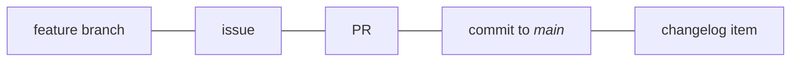

# Maintainers' guide

!!! abstract "How to use these docs"
    These docs are meant to be linked to.
    Include a link in your project's readme or `CONTRIBUTING.md` file.
    E.g.,
    ```markdown
    See https://dmyersturnbull.github.io/ref/maintainer-guide/
    but disregard the `security:` commit type.
    ```

    Or just link to individual sections; e.g.,
    ```markdown
    Source headers: Refer to https://dmyersturnbull.github.io/ref/maintainer-guide/#source-headers
    ```

This guide contains a collection of best-practices that are easy to learn, use, and automate.
They’re sufficient to get a correspondence between
issues, feature branches, pull requests, commits to the <i>main</i> branch, and changelog items.

This 1-1-1-1-1 correspondence simplifies project management, makes development more transparent,
and facilitates automation that reduces manual effort and potential human error.
(Complex things are hard; simple things are easy.)



## Branches

Use
[trunk-based development](https://www.atlassian.com/continuous-delivery/continuous-integration/trunk-based-development).
All development should happen in feature branches, and short-lived feature branches are preferred.
Name feature branches `<type>/<issue>-<description>--<author-initials>`, such as `feat/14-add-schema--dmt`.
(If necessary, modify `<author-initials>` to distinguish any users with the same initials.)

Each feature branch must be tied to exactly 1 issue and result in 1 merge to <i>main</i>.
Feature branches should be merged (rebased) into <i>main</i>.

!!! example

    ```mermaid
    gitGraph
    commit id: "initial" tag: "v0.1.0"
    commit id: "update docs"
    branch feat/12-async-api--dmt
    checkout feat/12-async-api--dmt
    commit id: "start feature"
    checkout main
    commit id: "fix bug" tag: "v0.1.1"
    checkout feat/12-async-api--dmt
    commit id: "complete feature"
    checkout main
    merge feat/12-async-api--dmt id: "squash and rebase" tag: "v0.2.0"
    ```

In some situations, earlier versions need to be maintained, such as for security fixes.
These must be in branches named `releases/<version>` (e.g., `releases/v1`).

## Issues

Issues to be worked on must have exactly 1 `type:` label, and they must have the label `status: ready for dev`.
Use `effort:` and `priority:` labels where helpful.

Split large issues into bit-sized pieces and list those in the larger issue’s description.

!!! example

    ```markdown
    Requires several steps:

    - [x] [write schema](#21)
    - [x] [build schema linter](#22)
    - [ ] [create infrastructure to deploy schema](#23)
    ```

## Handling pull requests

Do not submit a review until the required status checks completed successfully.
(You can add comments before this.)

When accepting pull requests, use either technique:

- Squash all commits into one **(most cases)**.
  The commit subject should be the pull request title; edit the title if necessary.
- Rebase all commits after ensuring that the messages conform to standards.

To help a contributor with their PR directly, see
["Committing changes to a pull request branch created from a fork"](https://docs.github.com/en/pull-requests/collaborating-with-pull-requests/proposing-changes-to-your-work-with-pull-requests/committing-changes-to-a-pull-request-branch-created-from-a-fork).
If the contributor abandoned the PR, instead use `gh pr checkout <number>`.

## Versioning

Versioning is a subset of [Semantic Versioning](https://semver.org/spec/v2.0.0.html).
Pre-releases are permitted only in the forms `alpha<int>`, `beta<int>`, and `rc<int>`,
where `<int>` starts at 0. Alpha/beta/RC MUST NOT be used out of order (e.g., **not** `alpha1`, `beta1`, `alpha2`).

## Tags and deployment

Tags of the form `v<semver>` should result in full deployments.
Tags of the form `v<major>` should automatically track their most recent semver tags.
The `latest` tag should always match the main branch.

Deploy off of the main branch or tags.
Make sure tests passed on the main branch before deploying.

## File types

- _Prefer open standards:_
  Choose AVIF or WEBP over other image formats, OGG and FLAC over other audio formats;
  choose AV1 over other video formats;
  and choose webm over (non-webm) MKV.
- _Use simpler formats:_
  Use Markdown
- _Use modern compression:_
  Prefer modern algorithms like [LZ4](https://github.com/lz4/lz4) (`.lz4`)
  and [ZSTD](https://github.com/facebook/zstd) (`.zst`).

## Source headers

Ensure that nontrivial files contain a header such as

```text
SPDX-FileCopyrightText: Copyright <years>, Contributors to <project>
SPDX-PackageHomePage: <url>
SPDX-License-Identifier: <spdx-id>
```

!!! example

    For [Tyranno](https://github.com/dmyersturnbull/tyrannosaurus), this is:

    ```text
    SPDX-FileCopyrightText: Copyright 2020-2023, Contributors to CICD
    SPDX-PackageHomePage: https://github.com/dmyersturnbull/tyranno
    SPDX-License-Identifier: Apache-2.0
    ```

## 3rd-party code

Use SPDX headers in the aforementioned form.
Include a section in `NOTICE.txt` mentioning the source file(s), license, and external source.
Include the license file in the form `LICENSE-<spdx-id>.txt`.

## Commit messages and changelog

We follow [Conventional Commits](https://www.conventionalcommits.org/) using the following types.
The general pattern for the subject is `<type>[(<scope>)][!]: <subject>`,
where `(<scope>)` is empty, `plugins`, or `i18n`; and `!` denotes a breaking change.

!!! example "Example 1"

    ```text
    feat!: add schema
    ```

!!! example "Example 2"

    ```text
    doc(i18n): add JP translation
    ```

This table shows how commit messages map to issue labels and changelog sections.

| Type        | Label               | Changelog section  | semver | Description                               |
|-------------|---------------------|--------------------|--------|-------------------------------------------|
| `security:` | `type: security`    | `🔒 Security`      | minor  | Fix a security issue                      |
| `feat:`     | `type: feature`     | `✨ Features`       | minor  | Add or change a feature                   |
| `fix:`      | `type: fix`         | `🐛 Bug fixes`     | patch  | Fix a bug                                 |
| `docs:`     | `type: docs`        | `📝 Documentation` | patch  | Modify docs or examples                   |
| `build:`    | `type: build`       | `🔧 Build system`  | minor  | Modify build                              |
| `perf:`     | `type: performance` | `⚡️ Performance`   | patch  | Increase speed or decrease resource usage |
| `test:`     | `type: test`        | `🚨 Tests`         | N/A    | Add or modify tests                       |
| `ci:`       | `type: ci`          | ignored            | N/A    | Modify CI/CD                              |
| `refactor:` | `type: refactor`    | ignored            | N/A    | Refactor source code                      |
| `style:`    | `type: style`       | ignored            | N/A    | Modify code style                         |
| `chore:`    | `type: chore`       | ignored            | N/A    | Change non-source code                    |

## Reference

!!! details "Full pattern"

    ```text
    <type>[(<scope>)][!]: <subject>

    <body>

    [BREAKING CHANGE: <breaking>]
    [Closes: #<issue>]
    [*: <author>]+

    Signed-off-by: <author>
    """
    ```

!!! example

    ```text
    feat!: add major new feature

    We added a major new feature.
    Here are details: ta-da.

    BREAKING CHANGE: many things

    Closes: #14
    Co-authored-by: Amelia Johnson <amelia@dev.com>
    Co-authored-by: Cecilia Johnson <cecilia@dev.com>
    Reviewed-by: Kerri Hendrix <kerri@dev.com>
    Acked-by: Tom Monson <joe@dev.com>
    Signed-off-by: Sadie Wu <sadie@dev.com>
    ```
